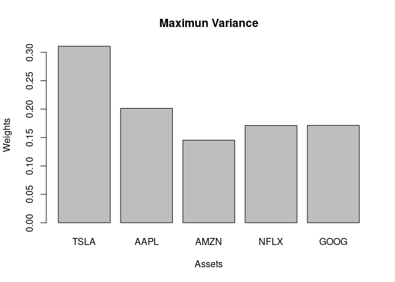
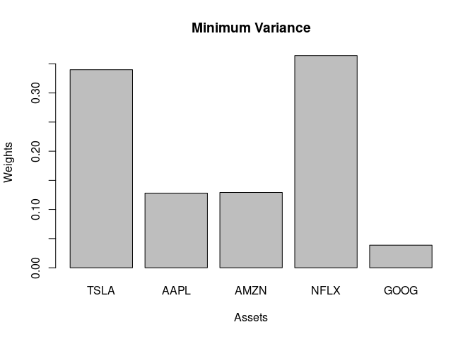

<!-- README.md is generated from README.Rmd. Please edit that file -->

# Investment-Portfolio Analysis

### Stock selection

The complete code for this project is available at
`Investment-Portafolio-Analysis.R`

First we will take a series of stocks with which we are going to
analyze. These actions were a personal choice but the analysis can be
performed with any set of actions. Future projects will explore methods
for choosing a portfolio of financial assets. The shares selected with
their corresponding percentages are in the portfolio the following:

| STOCKS | WEIGHT |
|--------|--------|
| TSLA   | 25%    |
| AAPL   | 25%    |
| AMZN   | 20%    |
| NFLX   | 15%    |
| GOOG   | 15%    |

Let’s take a look at the dataset to see what format it will take.

    ## # A tibble: 6 x 8
    ##   symbol date        open  high   low close   volume adjusted
    ##   <chr>  <date>     <dbl> <dbl> <dbl> <dbl>    <dbl>    <dbl>
    ## 1 TSLA   2011-01-03  5.37  5.4   5.18  5.32  6415000     5.32
    ## 2 TSLA   2011-01-04  5.33  5.39  5.20  5.33  5937000     5.33
    ## 3 TSLA   2011-01-05  5.30  5.38  5.24  5.37  7233500     5.37
    ## 4 TSLA   2011-01-06  5.37  5.6   5.36  5.58 10306000     5.58
    ## 5 TSLA   2011-01-07  5.6   5.72  5.58  5.65 11239500     5.65
    ## 6 TSLA   2011-01-10  5.63  5.74  5.61  5.69  6713500     5.69

------------------------------------------------------------------------

### Statistics and portfolio return

A series of calculations and analyses were made on the data in order to
obtain the cumulative return of the portfolio.

<!-- -->

    ## The average annual portfolio returns is 41.42%

    ## The daily portfolio volatility is 0.0173

It can be seen that the portfolio has a very good performance. With an
average annual return that is much higher than financial instruments
with high security such as government bonds or debt instruments. In
addition, the volatility of the portfolio is quite low, so the risk is
clearly reduced. One calculation that is quite valuable is the Sharpe
Ratio, which can give us a better idea of the performance of the
portfolio.

    ## The annual portfolio sharpe ratio calculated using the tq_performance function is 1.5053

------------------------------------------------------------------------

### Portfolio optimization

Now that the most important statistics about the portfolio are known, we
will look for the best combination on the percentage corresponding to
each stock. For this purpose, a series of simulations were made in which
different combinations were made and the minimum variance was measured.

    ## # A tibble: 2,624 x 5
    ##         AAPL     AMZN      GOOG       NFLX     TSLA
    ##        <dbl>    <dbl>     <dbl>      <dbl>    <dbl>
    ##  1  0         0        0         0          0      
    ##  2  0.00521   0.00428 -0.00370   0.0165     0.00188
    ##  3  0.00815   0.0129   0.0115   -0.00908    0.00598
    ##  4 -0.000809 -0.00836  0.00725  -0.00973    0.0384 
    ##  5  0.00714  -0.00199  0.00478   0.00733    0.0128 
    ##  6  0.0187   -0.00438 -0.00362   0.0467     0.00741
    ##  7 -0.00237  -0.00184  0.00293  -0.00657   -0.0538 
    ##  8  0.00810  -0.00141  0.00140   0.0120     0      
    ##  9  0.00365   0.00785 -0.000292  0.0136    -0.0278 
    ## 10  0.00807   0.0172   0.0121   -0.0000522 -0.0181 
    ## # … with 2,614 more rows

<!-- --><!-- -->
