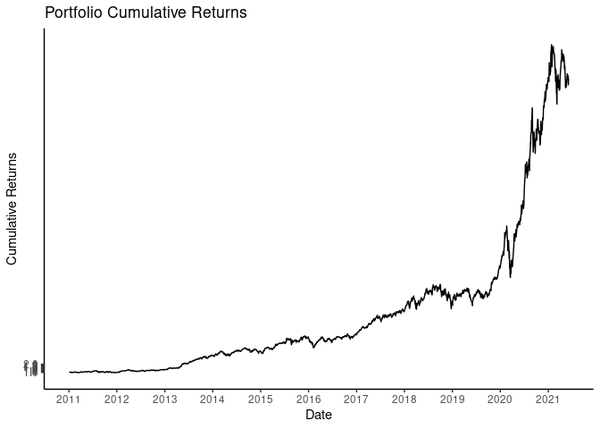

<!-- README.md is generated from README.Rmd. Please edit that file -->

# Investment-Portfolio Analysis

### Stock selection

The complete code for this project is available at
`Investment-Portafolio-Analysis.R`

First we will take a series of stocks with which we are going to
analyze. These actions were a personal choice but the analysis can be
performed with any set of actions. Future projects will explore methods
for choosing a portfolio of financial assets. The shares selected with
their corresponding percentages are in the portfolio the following:

| STOCKS | WEIGHT |
|--------|--------|
| TSLA   | 25%    |
| AAPL   | 25%    |
| AMZN   | 20%    |
| NFLX   | 15%    |
| GOOG   | 15%    |

Let’s take a look at the dataset to see what format it will take.

    ## # A tibble: 6 x 8
    ##   symbol date        open  high   low close   volume adjusted
    ##   <chr>  <date>     <dbl> <dbl> <dbl> <dbl>    <dbl>    <dbl>
    ## 1 TSLA   2011-01-03  5.37  5.4   5.18  5.32  6415000     5.32
    ## 2 TSLA   2011-01-04  5.33  5.39  5.20  5.33  5937000     5.33
    ## 3 TSLA   2011-01-05  5.30  5.38  5.24  5.37  7233500     5.37
    ## 4 TSLA   2011-01-06  5.37  5.6   5.36  5.58 10306000     5.58
    ## 5 TSLA   2011-01-07  5.6   5.72  5.58  5.65 11239500     5.65
    ## 6 TSLA   2011-01-10  5.63  5.74  5.61  5.69  6713500     5.69

------------------------------------------------------------------------

### Statistics and portfolio return

A series of calculations and analyses were made on the data in order to
obtain the cumulative return of the portfolio.

<!-- -->

    ## [1] "The portfolio return is %"

    ## The average annual portfolio returns is 41.4%

    ## The daily portfolio volatility is 0.0173

    ## The annual portfolio sharpe ratio calculated using the tq_performance function is 1.5043
